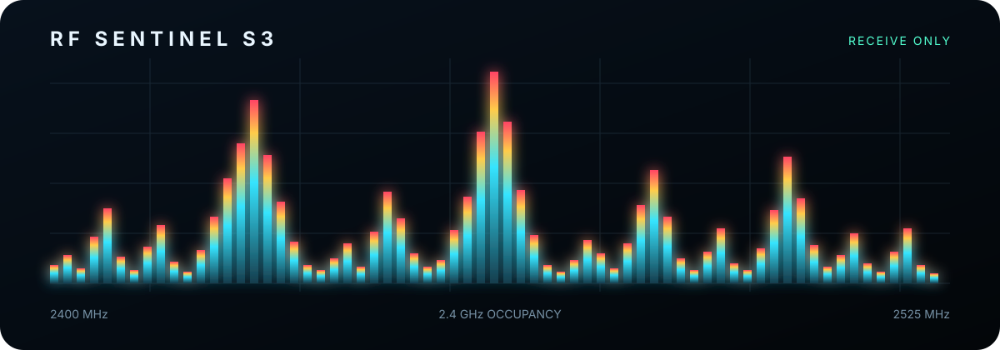
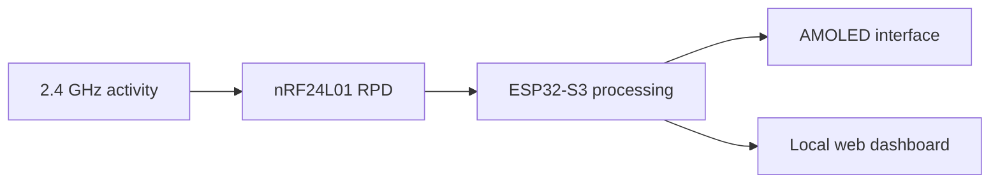
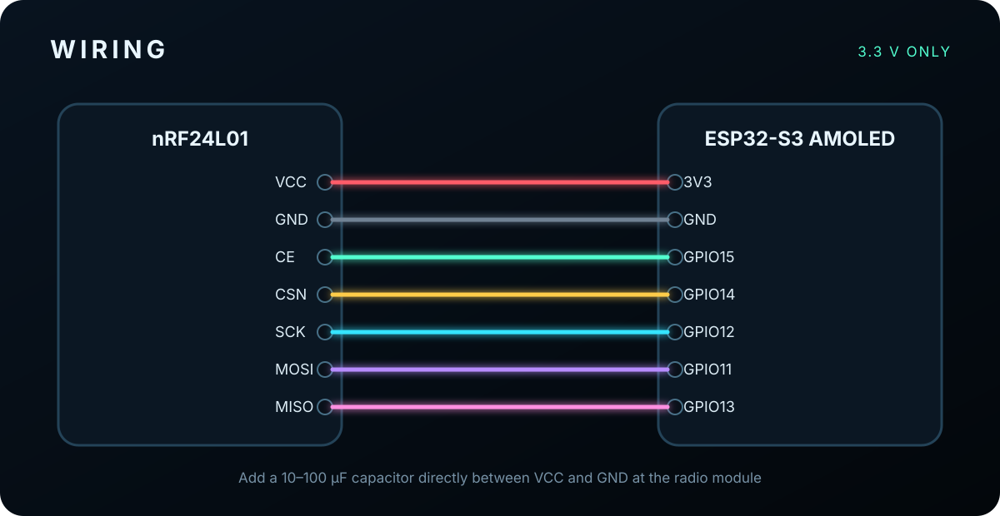

# RF Sentinel S3



<p align="center">
  
  
  
  
</p>

RF Sentinel S3 is a portable, receive-only 2.4 GHz activity monitor built with a Waveshare ESP32-S3-AMOLED-1.91 and an nRF24L01. It combines a live spectrum, rolling waterfall, nearby Wi-Fi context, and a responsive local dashboard in one compact device.

## Features

| Mode | Function |
|---|---|
| Spectrum | Displays relative activity across 126 channels from 2400 to 2525 MHz |
| Waterfall | Shows how activity changes over time and frequency |
| Wi-Fi context | Lists nearby Wi-Fi networks with channel and RSSI |
| Web dashboard | Streams the live spectrum to a phone or computer |

- Labeled frequency and activity axes
- Peak-frequency marker and live frame counter
- AMOLED interface controlled with the onboard BOOT button
- Separate hardware SPI buses for the display and radio
- No external router, cloud service, or mobile application required
- Receive-only nRF24L01 operation

## Web dashboard preview


The preview uses simulated sample values to show the interface. A real deployment updates the graph and statistics directly from the device.

## System overview



The nRF24L01 scans channels 0–125 and reports whether received power crossed its internal threshold during each sampling window. The ESP32-S3 converts these detections into relative occupancy values, smooths the result, and renders it locally and in the browser.

## Hardware

- Waveshare ESP32-S3-AMOLED-1.91
- nRF24L01 or nRF24L01+
- 10–100 µF capacitor
- Breadboard and jumper wires
- USB-C cable

## Wiring



| nRF24L01 | ESP32-S3 |
|---|---:|
| VCC | 3V3 |
| GND | GND |
| CE | GPIO15 |
| CSN | GPIO14 |
| SCK | GPIO12 |
| MOSI | GPIO11 |
| MISO | GPIO13 |
| IRQ | Not connected |

Place the capacitor directly across the nRF24L01 power pins. Match polarity when using an electrolytic capacitor. Never power the radio from 5 V.

## Quick start

1. Install the ESP32 board package in Arduino IDE.
2. Install `RF24 by TMRh20`.
3. Install `GFX Library for Arduino by Moon On Our Nation`.
4. Select `ESP32S3 Dev Module`.
5. Open `firmware/rf_sentinel_s3/rf_sentinel_s3.ino`.
6. Compile and upload the sketch.

Recommended board settings:

| Setting | Value |
|---|---|
| Board | ESP32S3 Dev Module |
| USB CDC On Boot | Enabled |
| Flash Size | 16MB |
| PSRAM | OPI PSRAM |
| Upload Mode | UART0 / Hardware CDC |
| Serial Monitor | 115200 baud |

## Controls

Press the board's built-in BOOT button to cycle through:

1. `SPECTRUM`
2. `WATERFALL`
3. `WI-FI`

The active function is highlighted at the top of the AMOLED interface.

## Browser dashboard

1. Connect to Wi-Fi network `RF-Sentinel-S3`.
2. Enter password `observe24`.
3. Open `http://192.168.4.1`.

The access point uses Wi-Fi channel 1, creating a known local signal in the lower part of the measured band.

## Measurement model

The nRF24L01 RPD register is a threshold detector, not a calibrated RSSI measurement. Each displayed value is calculated from repeated receive windows:

```text
occupancy = detected windows / sampled windows × 100%
```

The output is useful for relative channel-activity measurements, coexistence experiments, installation surveys, and recognizing recurring time-frequency patterns. It is not a calibrated spectrum analyzer or protocol decoder.

## Repository structure

```text
rf-sentinel-s3/
├── firmware/rf_sentinel_s3/rf_sentinel_s3.ino
├── docs/BUILD.md
├── docs/TESTING.md
├── assets/banner.svg
├── assets/dashboard-preview.png
├── assets/wiring.svg
├── CHANGELOG.md
├── LICENSE
└── README.md
```

Detailed instructions are available in the [build guide](docs/BUILD.md) and [test plan](docs/TESTING.md).

## Safety and scope

The firmware does not transmit nRF24 payloads, generate a continuous carrier, perform deauthentication, spoof devices, or implement interference functions. The ESP32 creates a normal low-power Wi-Fi access point only for the local dashboard.

## License

Released under the [MIT License](LICENSE).
